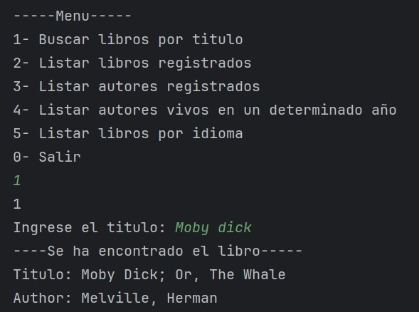
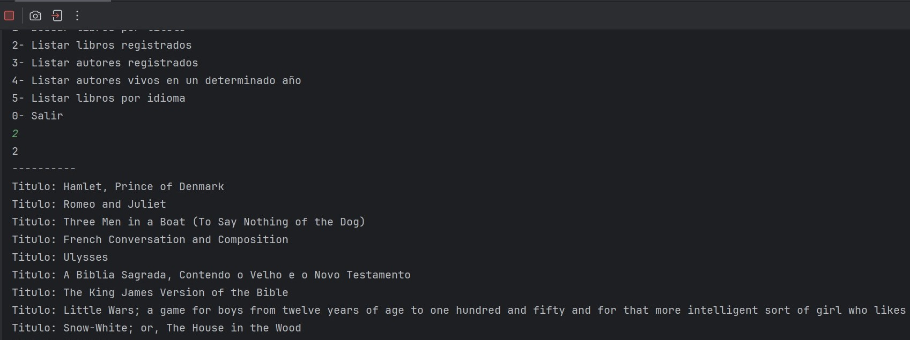
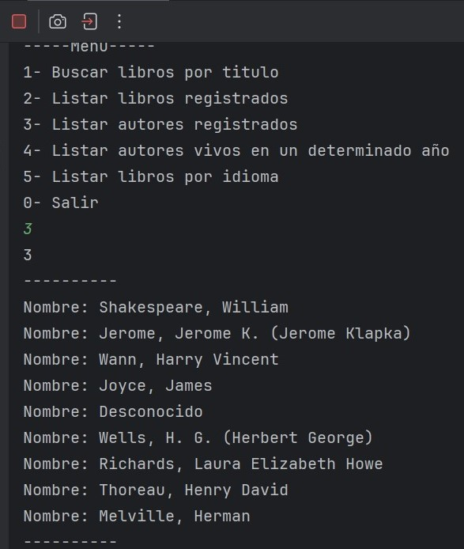
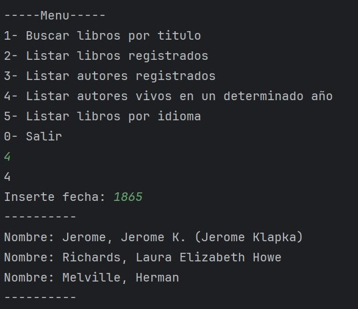
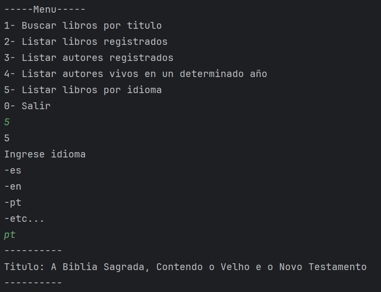

# Literalura

Proyecto SpringBoot JPA para el curso Oracle Next Education. 
Para poder iniciar el programa debes modificar el archivo 
<a href="/src/main/resources/application.properties">application.properties</a> 
y actualizar los datos para poder conectarlo con tu postgress 

 

<h3>Opcion 1</h3>

La opcion numero 1 permite buscar un libro consultando la api de 
<a href="https://gutendex.com/">https://gutendex.com/</a> usando el titulo del libro

<h3>Opcion 2</h3>

La opcion numero 2 nos muestra un historial de las consultas hechas en la opcion 1 
Los cuales fueron almacenados en nuestra base de datos postgres

<h3>Opcion 3</h3>

Lista todos los Autores de los libros buscados en la opcion 1

<h3>Opcion 4</h3>

Nos permite buscar los autores vivos de nuestra base de datos dado un numero 
  ingresado por teclado.

<h3>Opcion 5</h3>

Dado un idioma ingresado por teclado nos devuelve los libros que hay disponibles.

